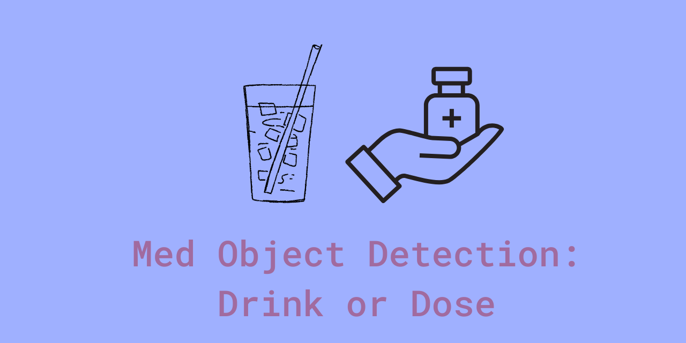

<!-- PROJECT LOGO -->
<br />
<div align="center">
  <a href="https://github.com/github_username/repo_name">
    
  </a>

<h3 align="center">Med Object Detection: Drink or Dose</h3>

  <p align="center">
    Build during Botnoi internship
</p>
</div>

<!-- TABLE OF CONTENTS -->
<details>
  <summary>Table of Contents</summary>
  <ol>
    <li>
      <a href="#about-the-project">About The Project</a>
      <ul>
        <li><a href="#built-with">Built With</a></li>
      </ul>
    </li>
    <li>
      <a href="#getting-started">Getting Started</a>
      <ul>
        <li><a href="#prerequisites">Prerequisites</a></li>
        <li><a href="#installation">Installation</a></li>
      </ul>
    </li>
    <li><a href="#usage">Usage</a></li>
    <li><a href="#roadmap">Roadmap</a></li>
    <li><a href="#contributing">Contributing</a></li>
    <li><a href="#license">License</a></li>
    <li><a href="#contact">Contact</a></li>
    <li><a href="#acknowledgments">Acknowledgments</a></li>
  </ol>
</details>


<!-- ABOUT THE PROJECT -->
## About The Project


Using AI to detect an object in the video and recognize the object whether ti is drink or dose.

### Dataset
#### Detail
- **Data Format:** Video.mp4
- **Tool for labeling:** Roboflow
- **Number of Classes:** 2, Drink and Dose
#### Data Split
- ***Train:*** 648
- ***Valid:*** 176
- ***Test:*** 115


<p align="right">(<a href="#readme-top">back to top</a>)</p>


### Built With

* 
*   
* 
*   
*   
* 
* 


<p align="right">(<a href="#readme-top">back to top</a>)</p>


## Run the program (app.py)
to use with video
```shell
python3 app.py --media "video" --video "sample_2.mp4"
```
to use real time
```shell
 python3 app.py --media "live"
```

## Contribution
@pangineering
